# Recovering Bambu Handy's printer-control RSA key from the Dart heap

How `runtime/handy_extract/extract_signing_key.py` pulls the printer-control RSA
**private key** out of the running Bambu Handy app's memory — no Frida, no
hooking, no native interception. This is what unlocked signed printer control in
`beambam` (pause / resume / stop / skip / gcode).

## TL;DR

The signing is pure-Dart, so there's no native crypto call to hook. But the RSA
key object lives in the Dart heap as plaintext big-integer digit arrays. We
already know the public modulus `n` (from the app's X.509 cert), so instead of
*factoring* `n` (infeasible) we **scan RAM for a 128-byte value that divides
`n`** — that's a prime factor `p`, and `p` hands us the entire private key.

## Status — fully validated (2026-06-11)

| Check | Result |
|---|---|
| Reconstructed key re-signs a captured Handy pre-image | matches **bit-for-bit** |
| `beambam.mqtt_sign.verify_message` on the wire | `True` |
| Live `beambam pause` | `err_code: 0, result: "SUCCESS", is_from_mqtt: true` |
| Live `beambam resume` | `err_code: 0, result: "SUCCESS", is_from_mqtt: true` |

A real running print paused and resumed on command — the recovered key drives
the printer for real. (Only `print.project_file` start is still blocked, and
**not** by signing — see the err-code table below.)

### Printer err-code disambiguation (from `device/<serial>/request` acks)

All four share the misleading reason string `"mqtt message verify failed"`
except `0`; the **code** is what distinguishes them:

| `err_code` | Meaning | Triggered by |
|---|---|---|
| `0` | accepted | a correctly-signed command (pause/resume confirmed live) |
| `84033543` | no / missing signature | unsigned command |
| `84033548` | signature present but **invalid** | a corrupted signature |
| `84033544` | signature **valid**, downstream **file/task** verify failed | a valid-sig `project_file` whose X2D dual-nozzle fields are incomplete |

Because a valid signature (`84033544`) yields a *different* code than a corrupt
one (`84033548`), the signature layer is provably passing — `84033544` is a
file/task problem, not a crypto problem.

## Why this works — find `p`, don't factor `n`

RSA's security is that recovering the key from `n = p·q` requires factoring `n`,
which is infeasible for 2048-bit `n`. We have an advantage the textbook attacker
lacks: **the app holds `p` in plaintext in RAM**, because it needs the primes to
sign. So we never factor anything.

- `n` is **public** — read from the app's X.509 cert (captured in the unsigned
  `security.app_cert_install`).
- Testing whether a candidate divides `n` is **cheap** (one big-int modulo).
- One prime is the whole game: `q = n / p`, then
  `d = e⁻¹ mod (p-1)(q-1)` and the CRT parameters.

"Break RSA" becomes "find the right 128 bytes in a heap dump."

## Why a memory scan and not a hook

The signing happens in **pure Dart** inside `libapp.so` (the Flutter AOT
snapshot — a pointycastle/BigInt RSA implementation). Proven the hard way:

- Zygisk hooks on `EVP_PKEY_sign`, `EVP_DigestSignFinal`,
  `rsa_private_transform_no_self_test`, `RSA_parse_private_key` were deployed and
  live — across **6 signed commands, zero fired** (while an `SSL_write` hook in
  the same lib captured fine). → not libflutter BoringSSL.
- `libgojni.so` is the OpenIM chat SDK, not the signer.

Pure-Dart bignum math makes **no native crypto call**, so there is nothing to
intercept. The cleartext key only exists as a Dart heap object — so that's where
you go.

## How a 1024-bit prime looks in the Dart heap

Dart stores a big integer's magnitude as a `Uint32List`: an array of 32-bit
digits, **little-endian, least-significant digit first**. A prime of a 2048-bit
key is 1024 bits = `1024 / 32 = 32` digits = **exactly 128 contiguous bytes**.

```
Dart Uint32List magnitude of a 1024-bit prime  p   (little-endian)

 byte:  0      4      8                       120    124    127
        +------+------+--      ...        --+------+------+
        | dig0 | dig1 |                      | dig30| dig31|
        +------+------+--      ...        --+------+------+
        ^ LSB  (p is odd  -> bit0 == 1)             ^ MSB (1024-bit -> top bit == 1)
        |<--------------- 128 bytes = 32 x uint32 --------------->|

        int.from_bytes(window, "little")  ==  p
```

So the search target is concrete: a **4-byte-aligned, 128-byte** window whose
little-endian value divides `n`. (4-byte alignment is safe because `Uint32List`
allocations are 4-byte aligned.)

## The pipeline

```mermaid
flowchart TD
    N["Known: modulus n<br/>(app X.509 cert)"]:::known
    ADB["adb + su (root)"] --> MAPS["read /proc/&lt;pid&gt;/maps"]
    MAPS --> REG{"anon rw region<br/>&ge; 1 MB, not 'dalvik'?"}
    REG -- "each, biggest first" --> DD["dd region over adb<br/>bs=1MB, skip/count_bytes<br/>conv=noerror,sync"]
    DD --> PF["numpy pre-filter:<br/>4-byte-aligned 128B windows<br/>odd AND top-bit-set"]
    PF --> DIV{"window value v<br/>divides n?"}
    DIV -- no --> PF
    DIV -- "yes" --> P["p = prime factor"]
    N -.-> DIV
    P --> Q["q = n / p"]
    Q --> KEY["d = e&#8315;&#185; mod (p-1)(q-1)<br/>+ CRT params<br/>&rarr; PKCS#8 PEM"]
    KEY --> V["verify: re-sign a captured<br/>pre-image, compare bit-for-bit"]
    classDef known fill:#1b3,color:#fff;
```



## Step by step

### 1. Locate the heap — `anon_rw_regions()` (extract_signing_key.py:45)

Root reads `/proc/<pid>/maps` via `su`. Keep regions that are:

| Filter | Why |
|---|---|
| perms contain `rw` | the live heap is writable |
| size `≥ 1 MB` | the Dart heap is large (key found in a ~140 MB `[anon]`) |
| name is **not** `dalvik` | that's the Java/ART heap; our key is a Dart object |

Sorted **biggest-first** — the Dart new/old-space heaps are the largest anon-rw
mappings.

### 2. Dump the bytes fast — `scan_region()` (extract_signing_key.py:71)

```sh
dd if=/proc/<pid>/mem bs=1048576 iflag=skip_bytes,count_bytes \
   skip=<lo> count=<size> conv=noerror,sync
```

- Toybox `dd` with `skip_bytes`/`count_bytes` reads an arbitrary byte range in
  1 MB blocks → far fewer syscalls than page-by-page.
- `conv=noerror,sync` is **essential**: Dart over-reserves heap address space, so
  many pages inside the mapping are uncommitted and would `EFAULT`; this
  zero-fills them and keeps going instead of aborting.
- The `dd` runs **on-device**; only raw bytes cross adb.

### 3. Scan — cheap pre-filter, then exact test (extract_signing_key.py:74)

A vectorized numpy pre-filter exploits two byte-level tells of a real 1024-bit
prime before any big-int arithmetic:

| Test | Expression | Rationale |
|---|---|---|
| **odd** | `(data[idx] & 1) == 1` | a large RSA prime is odd → LSB bit 0 set |
| **full width** | `(data[idx+127] & 0x80) != 0` | exactly 1024 bits → MSB (little-endian byte 127) top bit set |

These two single-byte tests eliminate the overwhelming majority of windows. For
each survivor, materialize the 128 bytes as a little-endian int `v` and test:

```python
if 1 < v < N and N % v == 0:   # exact: a divisor of n IS a prime factor
    return v
```

**No false positives:** a 2048-bit `n` has exactly two ~1024-bit prime factors,
so any 1024-bit value dividing it *is* one of the primes. (Robust to the prime
appearing multiple times — live bignum + CRT precomputes + GC copies; first hit
wins.)

### 4. Reconstruct the key (extract_signing_key.py:121)

```python
q = N // p
d = pow(e, -1, (p - 1) * (q - 1))            # e defaults to 65537
RSAPrivateNumbers(p, q, d,
                  dmp1=d % (p - 1), dmq1=d % (q - 1), iqmp=pow(q, -1, p),
                  public_numbers=RSAPublicNumbers(e, N)).private_key()
```

Written as PKCS#8 PEM to `~/.x2d/printer_sign_key.pem` (`chmod 600`, never
committed).

## Preconditions & failure modes

| Requirement | Why / symptom if missing |
|---|---|
| Root (`su`) | needed to read `/proc/<pid>/mem` |
| Handy running **and the key loaded** | open the **Devices** tab first — Handy auto-signs `get_access_code`/`liveview.prepare` on connect, materializing the key. No key in heap → "no factor found". |
| Correct modulus `n` | pass `--cert <app cert PEM>` or `--modulus-hex`; a wrong `n` will never find a divisor |
| Clean cwd | `$PREFIX/tmp` shadows stdlib `inspect`, breaking the numpy import — run from a dedicated dir |
| Right window size | 128 B assumes a 2048-bit key (1024-bit primes); a different key size needs a different window |

## Performance

The expensive part is the modulo test, gated behind the byte pre-filter that
numpy vectorizes over the whole region — so even a 140 MB heap scans in seconds
per region, and regions are tried biggest-first so the Dart heap is usually hit
on the first or second region.

## Why it beats the app's hardening

The app ships SHIELD/Promon whitebox protection, a non-extractable AndroidKeyStore
key, and fully-encrypted FlutterSecureStorage — none of which matters. The moment
the cleartext prime sits in an ordinary rw heap page and `n` is public, the key
is recoverable with arithmetic alone.

## References

- Implementation: `runtime/handy_extract/extract_signing_key.py`
- Signing scheme + wire format: `beambam/mqtt_sign.py`, `runtime/handy_extract/SIGNER_HANDOFF.md`
- Signed cloud control: `beambam/cloud_control.py`, `beambam/cli/control.py`
- Fast `/proc/<pid>/mem` scanning notes: `~/.claude/CLAUDE.md` (Termux specifics)
